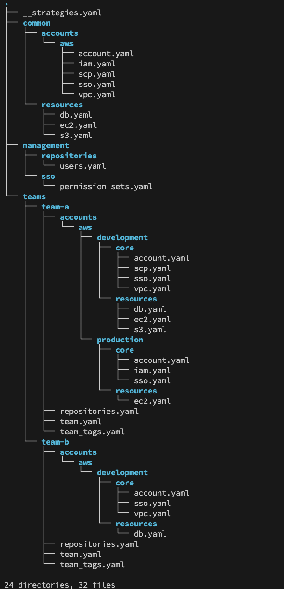
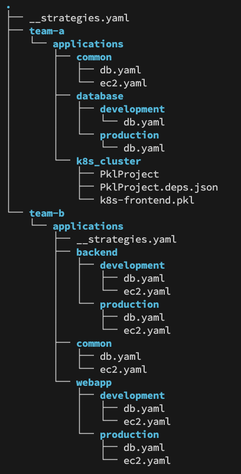

# Example 9 Documentation

## Overview

Example-9 is a config that can be used to manage core infrastructure in an AWS environment plus team specific configuations. The example is intended to be completely DRY (Don't Repeat Yourself). 

The directory and file structure for the core infra under `/infra` is depicted below:



The structure has root for all core infrastructure config, this is in directory `/infra`. 

There is a `common` area where configuration standard values are stored. 

The `teams` area is where team specific settings are stored. These include some core AWS accounts, some account specific resources such as databases, instances and buckets, as well as team specific resources such as Git repositories. 

The common values are the basis for team specific values, and team specific are merged over the top of common. Tags that should be applied to any resources applied by pipeline, such as cost_center. This makes it easy to change a cost center and have it update all affected resources by virtue of their pipelines that are triggered via ECS webhooks. 

## Pipelines

The configurations are intended to be read by pipelines, potentially with Terraform iterating over config to syncronize state with configuration. 

Pipelines that would typically be created for this config include:

### Core Teams pipeline

  This would create and update team non AWS account specific resources such as a teams Git and, Artifactory repositories. An an example, config for a teams Git repositories woulkd be emitted to the pipeline using the command: 

  `cto ecs config build --path config-examples/example-9/infra/teams/team-a/repositories.yaml`

  The output is simply the contents of the file. 

### Core SSO pipeline

  This would create the permission sets in the AWS master account, the permission sets are then referenced and enabled in specific accounts via the accounts pipeline. Config for this pipeline would be emitted using the command:

  `cto ecs config build --path config-examples/example-9/infra/management/sso/permission_sets.yaml`

  As with the repositories example, the output is the contents of the specified file. 

### Core Accounts pipeline

  This would create and update AWS accounts and set up their core attributes, such as SSO settings, VPCs, SCPs, certificates, IAM, anything that is considered core to the AWS accounts configuration. As an example, updating config in `sso.yaml` for an account would trigger the pipeline and update the account that has been changed. Config for this pipeline would be emitted using command:

  `cto ecs config build --path config-examples/example-9/infra --strategy-name team_aws_account --config-var team team-a --config-var account development`

  The output is the entire config for the specified account, with common used as a source for the majority of the data.

```yaml
  account:   
    account_details:
      account_email: team-a-development@cto.com
      account_name: Team A - Development    
      environment: development   
      organization_unit: development        
    enabled_modules:
      delete_default_vpc: true   
      iam: true     
      kms:   
        eu-west-2: false         
        us-east-1: false         
        us-east-2: false         
      sso: true     
      vpc:   
        eu-west-2: false         
        us-east-1: true          
        us-east-2: false         
    tags:    
      cost_center: team-a        
  scp:       
    policies:
    - Team-A-1-SCP  
    tags:    
      cost_center: team-a        
  sso:       
    permission_sets:
    - name: S3ReadOnly           
      principles:   
      - name: user1@cto.com      
        type: USER  
    tags:    
      cost_center: team-a        
  vpc:       
    tags:    
      cost_center: team-a        
    us-east-1:      
      ipv4_ipam_pool_id: ipam-pool-a-1      
      transit_gateway_id: tgw-a-1
    us-east-2:      
      ipv4_ipam_pool_id: ipam-pool-us-east-2
      transit_gateway_id: tgw-us-east-2
```

### Core Resources Pipelines

  Where team AWS resources such as databases, instances and buckets are managed by a central team, config for these resources is stored under the `infra` path.

  The resources could be managed in one pipeline but it would be typical to split distinct resources into their own pipelines. If using one pipeline for all resources, config would be emitted using command:

  `cto ecs config build --path config-examples/example-9/infra --strategy-name account_resources_with_identifiers --config-var team team-a --config-var account development`

  Where individual pipelines are used for each resource type, whilst the whole resources config is built, using ECS filtering it is possible to emit just the specific resources. Examples are:

  `cto ecs config build --path config-examples/example-9/infra --strategy-name account_resources_with_identifiers --config-var team team-a --config-var account development --filter 'postgres`

  The output is as follows:

  ```yaml
  us-east-1:  
  db-instance-team-a-account-1:
    backup_retention_period: 7
    engine_version: '15.3'    
    instance_class: db.t3.medium
    iops: null          
    max_allocated_storage: 500
    monitoring_interval: 60   
    storage_encrypted: true   
    storagesize: 100    
    storagetype: gp3    
    tags:       cost_center: team-a     
      name: Postgres RDS
    username: administrator   
us-east-2:
  db-instance-team-a-account-1-east-2:
    backup_retention_period: 7
    engine_version: '15.3'    
    instance_class: db.t3.medium
    iops: null          
    max_allocated_storage: 500
    monitoring_interval: 60   
    storage_encrypted: true   
    storagesize: 100    
    storagetype: gp3    
    tags:       
      cost_center: team-a     
      name: Postgres RDS
    username: administrator  
```

or to get S3 config:

  `cto ecs config build --path config-examples/example-9/infra --strategy-name account_resources_with_identifiers --config-var team team-a --config-var account development --filter 's3`


### Team Specific Config Areas

Under the `/teams` directory, we have 2 teams, team-a and team-b. There is a strategy file provided by the ECS team that lives in the `/teams` directory, all teams can take advantage of this strategy for basic merging of configurations by passing in their team name as a variable. As they only have access to their individual team's config area, passing another team's name as a variable will not give them access to the other team's data. 

The `/teams` directory and file structure is depicted below:



#### Team-a config

Team-a are taking advantage of the provided strategy to have a DRY config for their development and production databases. They also have a frontend application, the frontend team wanted to use Pkl as a config language, the 2 coexist in the team's config area. To build the database config, they use the following command:

`cto ecs config build --path config-examples/example-9/teams --strategy-name apps --config-var application database --config-var environment production --config-var team team-a`

This provides output as follows:

```yaml
{
  "postgresql": {
    "tags": {
      "name": "Postgres RDS",
      "env": "production",
      "cost_center": "team-a"
    },
    "instance_class": "db.r6g.xlarge",
    "engine_version": 15.3,
    "username": "admin",
    "storagetype": "io1",
    "iops": 23000,
    "storagesize": 400,
    "max_allocated_storage": 2000,
    "storage_encrypted": true,
    "backup_retention_period": 7,
    "monitoring_interval": 60,
    "db_name": "webapp-db-production",
    "password": "ENC[AES256_GCM,data:R4UNSlcVAA7bI09bUGTdBJrdvDGMlQ==,iv:vu+Lfv0qtVSeyqALnEmEpRrPecIOpGhKJkKIfYWyvd0=,tag:xLcSl4D6xmxXsjbAKD+X0A==,type:str]",
    "security_groups": [
      "sg-987654321"
    ],
    "vpc": "vpc-prod"
  }
}
```

To build the frontend config they use:

`cto ecs config build --path config-examples/example-9/teams/team-a/applications/k8s_cluster/k8s-frontend.pkl`

The output is as follows:

```yaml
apiVersion: v1       
kind: Service
metadata:
  labels: 
    app: guestbook   
    tier: frontend   
  name: frontend     
spec:     
  ports:  
  - port: 80 
  type: NodePort     
  selector:  
    app: guestbook   
    tier: frontend   
---       
apiVersion: apps/v1  
kind: Deployment     
metadata: 
  name: frontend     
spec:     
  template:
    metadata:
      labels:
        app: guestbook         
        tier: frontend         
    spec: 
      containers:    
      - image: gcr.io/google-samples/gb-frontend:v4                                                           
        resources:   
          requests:
            cpu: 100m
            memory: 100Mi      
        env: 
        - name: GET_HOSTS_FROM 
          value: dns 
        ports:       
        - containerPort: 80    
        name: php-redis        
  replicas: 3
  selector:  
    matchLabels:     
      app: guestbook 
      tier: frontend
```

#### Team-b

Team-b wanted to use YAML and to do a more sophisticated merge, so they created their own strategy file. The ECS team could have written it for them and placed it in the `/teams` directory strategy file, therefore making it useful for other teams, but in this case, they wrote it themselves and stored it in their own `applications` directory. 

The premise behind this strategy is that they require a list of resources with identifiers split by region as they team have resources in multiple regions. To build the config they use command:

`cto ecs config build --path teams/team-b/applications --strategy-name regional_with_identifiers --config-var application backend --config-var environment development`

 The strategy provides the following output:

 ```yaml
 {
  "postgresql": {
    "us-east-1": {
      "webapp-db-dev": {
        "tags": {
          "name": "Postgres RDS",
          "env": "development",
          "cost_center": "team-b"
        },
        "instance_class": "db.r6g.small",
        "engine_version": 15.3,
        "username": "admin",
        "storagetype": "io1",
        "iops": 13000,
        "storagesize": 200,
        "max_allocated_storage": 2000,
        "storage_encrypted": true,
        "backup_retention_period": 7,
        "monitoring_interval": 60,
        "password": "ENC[AES256_GCM,data:zSUyyYbwbx8DVolmJoD4Tht6sqOne+n47Sn2GyvbLLi9wycibksRZNq/H4geiAhBQztg/CElcL5gAkgfdfykl0yJLFVKLreGEF35bEG0vNrBSOiTgPdZT7mJer/beMh0O4ndqe3LDnIxSu6W5UsEBV6C8Ck/xx6vaq/MpQQuRHryOjg=,iv:lfWQTBaJBRcEMzAn76SKARMxWUN5ulTdpDHOCctXqYo=,tag:2tibmFXVtR4zj+6F9rRVfA==,type:str]",
        "security_groups": [
          "sg-123456789"
        ],
        "vpc": "vpc-development"
      }
    }
  },
  "ec2": {
    "us-east-1": {
      "web-server-1-development": {
        "ami": "ami-12345678901-east-1",
        "instance_profile": null,
        "instance_profile_policies": [
          "AmazonSSMManagedInstanceCore",
          "AmazonS3FullAccess"
        ],
        "vpc_name": "vpc-development",
        "tags": {
          "env": "development",
          "cost_center": "team-b"
        }
      },
      "web-server-2-development": {
        "ami": "ami-12345678901-east-1",
        "instance_profile": null,
        "instance_profile_policies": [
          "AmazonSSMManagedInstanceCore",
          "AmazonS3FullAccess"
        ],
        "vpc_name": "vpc-development",
        "tags": {
          "env": "development",
          "cost_center": "team-b"
        }
      }
    }
  }
}
```

It can be seen that the password for the DB is encrpyted, it would be decrypted in the pipeline by adding `--show-secrets` to the `cto ecs config build` command. If they have permission, the secret will be decrpyted.


## Access Control

In this example, there are 2 user personas:

  - Core infra team
  
  This team manages everything in the `/infra` directory structure. They are responsible for all account pipelines. This team might be the overall admins of the ECS platform or if they are not, they can be setup as ECS users rather than admins so they can be restricted to only managing config under `/infra` and can't see `/teams` data.

  - Non core infra team, i.e. application teams, devops, SRE etc

  Team-a has access to everything in `/teams/team-a` directory, and also has read-only access to the `/infra/teams/team-a` directory so they can read the teams centrally managed tags. Team-b has access to their respective team area. 